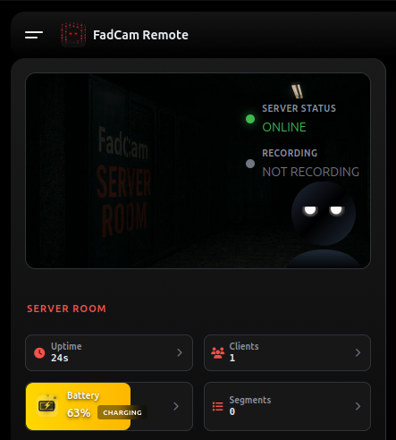

<!-- 
    CHANGELOG FORMAT GUIDE
    =====================
    
    Markdown Syntax:
    - Use # for main headers (h1)
    - Use ## for section headers (h2)  
    - Use ### for subsection headers (h3)
    - Use --- on its own line for visual dividers
    - Use - for bullet points
    - Emojis are supported throughout
    
    Example:
    # Main Title (h1 - largest, uses 28sp)
    ## Section Title (h2 - 22sp)
    ### Subsection (h3 - 18sp)
    
    - Bullet point content
    - Another point
    
    --- (becomes visual divider)
    
    # Next Major Section

    # You can use images too, paste them in assets/changelog/ and reference like this:
    
    
    NOTE: This file is parsed to render dividers, headers, and content dynamically.
-->

# Note
`Many users are unaware of a hidden feature in FadCam. Yes, there is a trash directory, but it is normally inaccessible for the user’s privacy. To access it, simply long-press the FadCam icon you see in the header of the Home tab, and you will enter it. From there, you can recover deleted files or permanently delete them. Hopefully, this will reduce emails about “Where is my deleted video?” :)`

---

# ✨ New Features  

## FadCam Pro - Limited Time Free Offer!
- **FadCam Pro** is now available for free for a limited time. Get customized builds with custom notification icons that actually display in your notification bar. [Learn more on Patreon](https://www.patreon.com/posts/fadcam-pro-free-145013262)

## This What's New Page
- New in-app **What's New** page to showcase new features after updates.

## 📸 FadRec - Screen Recorder
- Record your screen using the **FadRec** tab. Videos are saved in the `Records` tab with the `FadRec_` prefix.

## 🏠 FadCam Remote - Live Streaming & Remote Control

- Stream your camera feed live over your local network with a beautiful web interface.
- Remote control features: start/stop recording, change settings, toggle torch, trigger security alarms.
- Real-time monitoring: battery level, storage status, recording status, and memory/storage usage.

## 🏠 Home
- Improved UI for better user experience.

## ⚙️ Settings & UI
- Reordered settings for faster access to commonly used options.
- `New` feature badges appear when you update the app to highlight new features.

## 📷 Camera
- Migrated to **fragmented MP4** format for zero risk of file corruption.
- **Custom watermark text**: Add personalized text to your videos (e.g., license plate, location name, room identifier).

---

# 🐞 Bug Fixes & Improvements  
- Fixed video corruption issues - videos now remain playable even if the app crashes or phone shuts down unexpectedly.
- Patched a memory leak issue.
- Various minor bug fixes and improvements.